<div align="center">


# ⚡ HARIS AHMED ⚡
## `Front-End Engineer // UI Architect // Web Builder`


</div>

<br>

<table align="center">
<tr>
<td width="60%" valign="top">

## 🧠 PROFILE

<table>
<tr><td><b>Name</b></td><td>Haris Ahmed</td></tr>
<tr><td><b>Role</b></td><td>Front-End Software Engineer</td></tr>
<tr><td><b>Location</b></td><td>Karachi, Pakistan 🇵🇰</td></tr>
<tr><td><b>Work Mode</b></td><td>Remote</td></tr>
<tr><td><b>Education</b></td><td>BSc Computer Science, University of the People</td></tr>
<tr><td><b>Status</b></td><td>Deploying pixel-perfect UIs from Figma → Production</td></tr>
</table>

I turn Figma blueprints into fully responsive, production-grade
web applications. 2+ years engineering scalable, high-performance
interfaces with **React.js, Next.js, Tailwind CSS & Material-UI**,
wired into RESTful APIs and shipped to real users.

</td>
<td width="40%" align="center">

</td>
</tr>
</table>

---

## 🛠️ TECH STACK

<div align="center">

</div>

<p align="center">


</p>

---

## 🏭 THINGS I'VE BUILT

<table align="center" width="100%">
<tr>
<td width="50%" valign="top">

### 🔷 Business Management Platform
React.js · Next.js · Tailwind CSS
Cloud-based all-in-one platform: unified dashboards, work order
management, custom workflow config, role-based access, and
integrated financial modules (budgeting, estimates, invoicing).

### 🔶 Corporate Energy Website
React.js · Next.js · Tailwind CSS
High-converting corporate site for a solar energy company,
showcasing service offerings, product line, customer journey,
responsive & performance-optimized.

</td>
<td width="50%" valign="top">

### 🔷 Employer Hiring Platform
React · MUI · HeroUI · Directus.io
Platform for employers to onboard, create jobs, launch skill-based
assessments, and invite global candidates, with full analytics
dashboards.

### 🔶 Candidate Portal
React · MUI · HeroUI · Directus.io
AI-powered onboarding, skill assessments + certifications, and
job matching for a global user base.

</td>
</tr>
</table>

---

## 📡 EXPERIENCE

```
[2025 - PRESENT]   Web Developer (Remote)
                    → Figma-to-production builds, component architecture,
                      SEO/perf/accessibility optimization, deployment ops.

[2024 - 2025]      Frontend Software Engineer (Remote)
                    → React/MUI/HeroUI interfaces, REST API integration,
                      Git-based collaborative workflows.

[2023 - 2024]      Website Developer, WordPress | Shopify | Wix
                    → Cross-browser, mobile-first builds, technical SEO,
                      independent multi-project delivery.
```

---

## 📊 GITHUB ANALYTICS

<p align="center">


</p>

<p align="center">

</p>

<!--
  Transparent visitor counter (public repo view count only,
  no IP capture, no geolocation, no personal identification).
-->
<p align="center">

</p>

---

## 🎓 CERTIFICATIONS ARCHIVE

- ✅ Web & Mobile Application Development, Saylani Mass IT Training
- ✅ HTML, CSS & JavaScript for Web Developers, Johns Hopkins University
- ✅ WordPress Website Developer Course, Udemy
- ✅ JavaScript Firebase Bootcamp, Udemy
- ✅ React Course, Udemy

---

## 📡 CONNECT

<p align="center">
<a href="https://haris386.github.io/MyPortfolio/"></a>
<a href="mailto:harisahmed873@gmail.com"></a>
<a href="https://www.linkedin.com/in/haris-ahmed-998a69183/"></a>
<a href="https://www.instagram.com/haris_ahmedrdj/?hl=en"></a>
</p>

<div align="center">
<sub>⚡ "Sometimes you gotta run before you can walk." - this repo included ⚡</sub>
</div>
